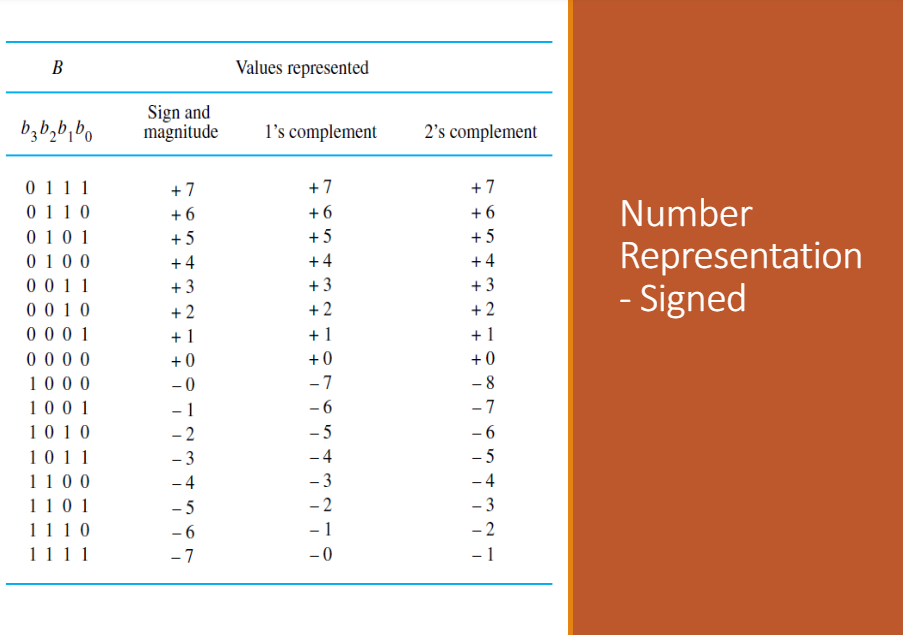

## ASCII table
- Stores only 128 characters
- Mostly english characters
- Unicode was made to replace characters that were not in ASCII, such as European, Cyrillic, Chinese Mandarin characters.
- Doing this allows people of different languages to use the computer.

## Decimal
Humans in their day to day life, use denary (or decimal) number system. (0 to 9)

## Binary
Binary Strings contains 1s and 0s. There are 2 categories of binaries:
- Signed
- Unsigned

Unsigned numbers are used for memory addresses, cluster numbers (in filesystems) and process identifiers (PID).  
If there are N bits in a binary number, the range of the numerical value will be: $$2^N -1$$

## Number Representation
Hexa decimal is base 16, (0 to 9 and A to F). Sometimes and 0x is added in front to represent things like memory addresses.

## Signed numbers
To represent the value type, the leftmost bit is used to represent positives or negatives. 0 would represent positive and 1 will represent negative.  
There are three ways to represent signed numbers:
| Sign and magnitude | 1's complement | 2's complement |
|---|---|---|

## example of system:
